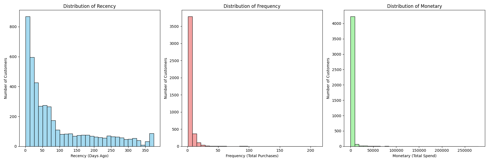
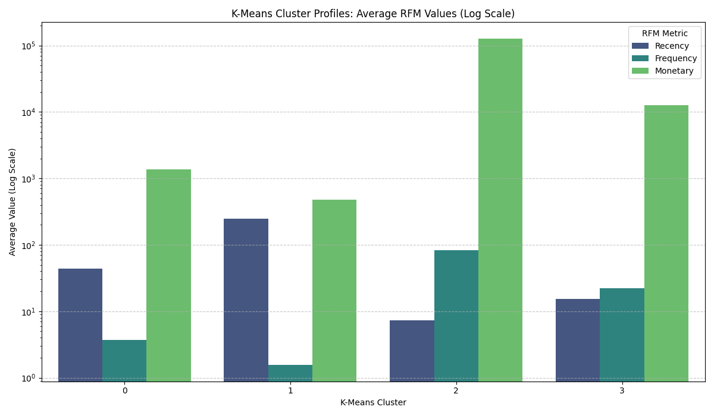
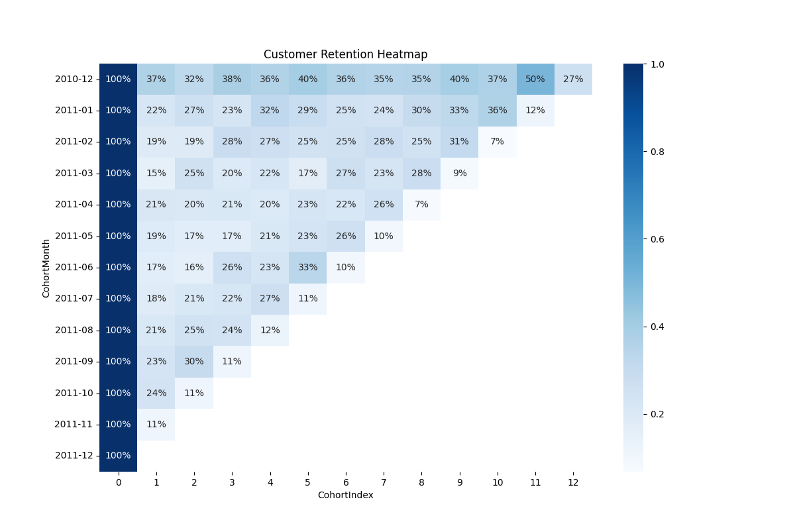
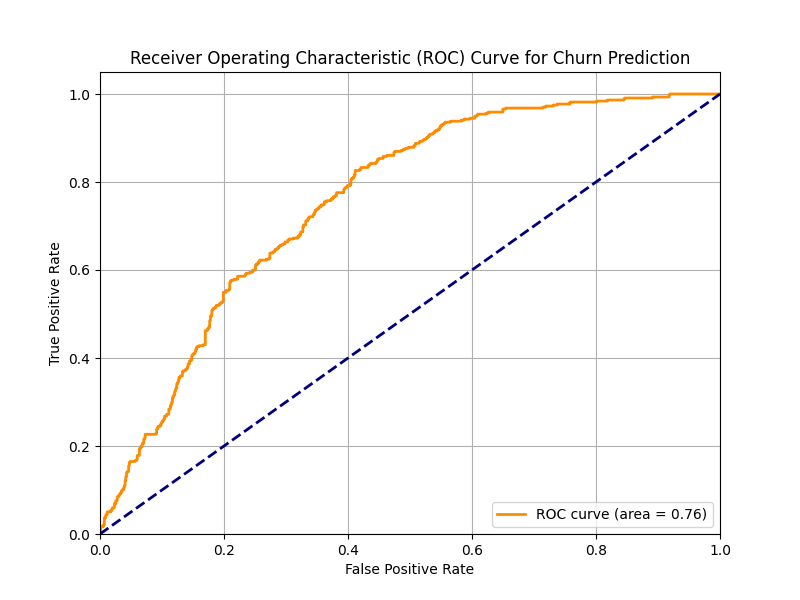

# Retail Customer Analytics

Customer analytics and segmentation project using RFM analysis, cohort analysis, clustering, customer lifetime value estimation, and churn-risk identification techniques on the UCI Online Retail dataset.

---

# 📊 Project Overview

This project focuses on analyzing customer purchasing behavior and revenue contribution patterns using the UCI Online Retail dataset. The objective was to identify high-value customer segments, evaluate customer engagement patterns, estimate customer lifetime value, and identify customers showing signs of reduced engagement or churn risk.

The project combines customer analytics, machine learning, business intelligence, and visualization techniques to generate actionable insights for customer retention, segmentation, and revenue optimization.

---

# 🎯 Objectives

* Analyze customer purchasing behavior and transactional trends
* Identify high-value and low-engagement customer groups
* Perform customer segmentation using clustering techniques
* Evaluate customer retention using cohort analysis
* Estimate Customer Lifetime Value (CLV)
* Generate business insights for customer retention strategies

---

# 🗂️ Dataset

### Dataset Used

* UCI Online Retail Dataset

### Dataset Features

* Invoice information
* Product descriptions
* Quantity purchased
* Invoice dates
* Customer IDs
* Country-wise transaction details

### Dataset Type

Transactional retail data containing customer purchase history from an online retail store.

---

# 🛠️ Technologies Used

* Python
* Pandas
* NumPy
* Matplotlib
* Seaborn
* Plotly
* Scikit-learn
* Statsmodels

---

# ⚙️ Methodology

## 1. Data Cleaning & Preprocessing

The dataset was cleaned and preprocessed by:

* Removing missing customer IDs
* Handling duplicate records
* Filtering cancelled transactions
* Creating revenue-related variables
* Converting date variables into datetime format

---

## 2. Exploratory Data Analysis (EDA)

Performed exploratory analysis to understand:

* Revenue distribution
* Purchasing trends
* Country-wise sales contribution
* Customer purchasing patterns

---

## 3. RFM Analysis

Customers were evaluated using:

* **Recency** → How recently a customer made a purchase
* **Frequency** → How often a customer purchased
* **Monetary Value** → Revenue generated by customers

RFM analysis helped identify:

* Loyal customers
* High-value customers
* At-risk customers
* Low-engagement customers

---

## 4. Customer Segmentation

Customer segmentation was performed using K-Means Clustering based on customer purchasing behavior and transactional patterns.

The segmentation process helped identify:

* High-value customer groups
* Frequent buyers
* Low-engagement customers
* Revenue-contributing segments

---

## 5. Cohort Analysis

Cohort analysis was conducted to evaluate:

* Customer retention patterns
* Long-term customer engagement
* Cohort-wise retention decay

The analysis revealed changes in retention behavior across different customer acquisition periods.

---

## 6. Customer Lifetime Value (CLV)

Customer Lifetime Value (CLV) estimation was performed to identify:

* Long-term profitable customers
* Revenue-generating customer groups
* Customer contribution patterns

---

## 7. Churn-Risk Identification

Customers showing:

* High recency
* Low purchase frequency
* Reduced engagement

were identified as potential churn-risk customers.

The analysis provides insights that can support targeted customer retention strategies and personalized marketing interventions.

---

# 📈 Key Insights

* A relatively small proportion of customers contributed a significant share of total revenue.
* Distinct customer segments displayed different purchasing and engagement behaviors.
* Cohort analysis revealed declining retention trends over time.
* High-recency and low-frequency customers exhibited potential churn-risk characteristics.
* Customer segmentation enabled identification of valuable customer groups for personalized marketing strategies.

---

# 💼 Business Recommendations

* Implement personalized retention campaigns for high-risk customers.
* Prioritize loyalty programs for high-value customer segments.
* Use cohort retention trends to improve onboarding and engagement strategies.
* Develop targeted marketing campaigns based on customer segmentation.
* Utilize customer lifetime value insights for revenue optimization strategies.

---

# 📊 Visualizations Included

* Revenue Distribution Analysis
* RFM Distribution Analysis
* Customer Segmentation Scatterplots
* Cohort Retention Heatmaps
* CLV Distribution Analysis
* Country-wise Revenue Analysis
* ROC Curve and Feature Importance Analysis

---

# 🚀 Future Improvements

Potential future enhancements include:

* Advanced churn prediction models
* Recommendation systems
* Interactive dashboard deployment using Streamlit
* Real-time customer analytics pipelines
* Deep learning-based customer behavior modeling

---

# ✅ Conclusion

This project demonstrates how customer analytics and machine learning techniques can be applied to transactional retail data to generate meaningful business insights. By integrating RFM analysis, cohort analysis, customer segmentation, and customer lifetime value estimation, the project provides a comprehensive understanding of customer behavior, retention patterns, and revenue contribution dynamics.

The analysis highlights the importance of data-driven customer intelligence strategies in improving customer engagement, retention, and long-term business performance.

